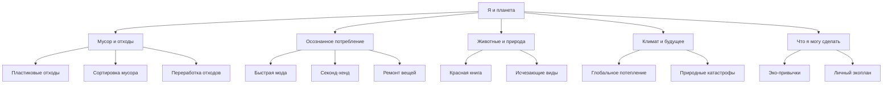

# Раздел 8: Я и планета (Экология и мир вокруг)

## Тема раздела

Раздел посвящён экологии и влиянию человека на окружающую среду.  
Цель — объяснить детям экологические проблемы и способы заботы о планете.

Темы раздела:

- углеродный след
- сортировка мусора
- переработка отходов
- осознанное потребление
- защита животных
- изменение климата

## Роли в команде

Участник 1 — анализ WikiData и SPARQL-запросы  
Участник 2 — анализ WikiData и SPARQL-запросы  
Участник 3 — разработка онтологии  
Участник 4 — генерация статей  
Участник 5 — структура репозитория  
Участник 6 — разработка Python-скрипта для ссылок

## Онтология раздела

## Генерация текстов

Для генерации текстов используется языковая модель GPT.

Промпт для генерации:

"Объясни понятие для десятилетнего ребёнка простым языком, используя короткие предложения и примеры."

